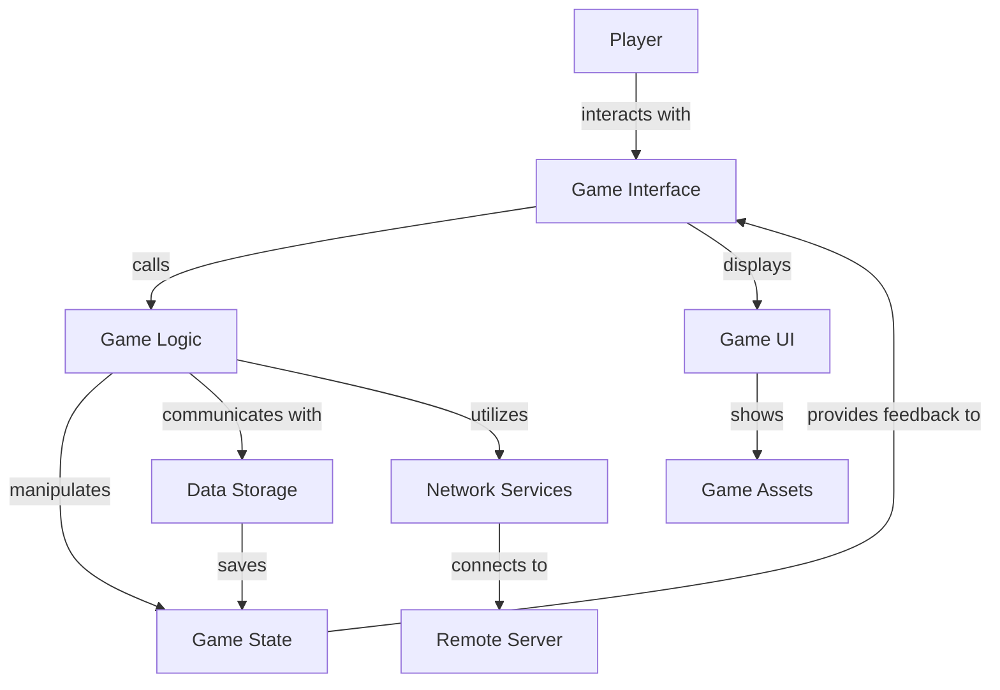

```mermaid
graph TD;
    A[Player] -->|interacts with| B[Game Interface];
    B -->|calls| C[Game Logic];
    C -->|manipulates| D[Game State];
    C -->|communicates with| E[Data Storage];
    E -->|saves| D;
    D -->|provides feedback to| B;
    C -->|utilizes| F[Network Services];
    F -->|connects to| G[Remote Server];
    B -->|displays| H[Game UI];
    H -->|shows| I[Game Assets];
```